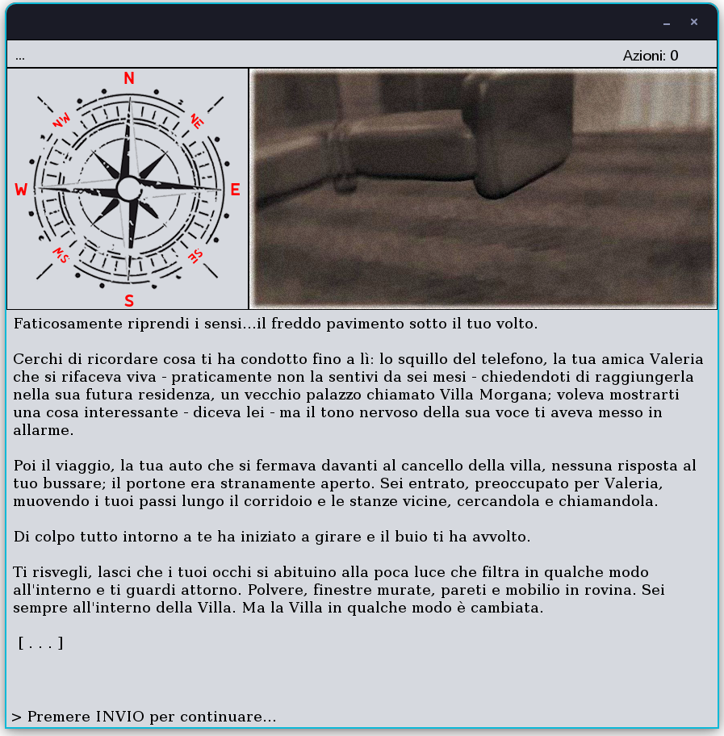
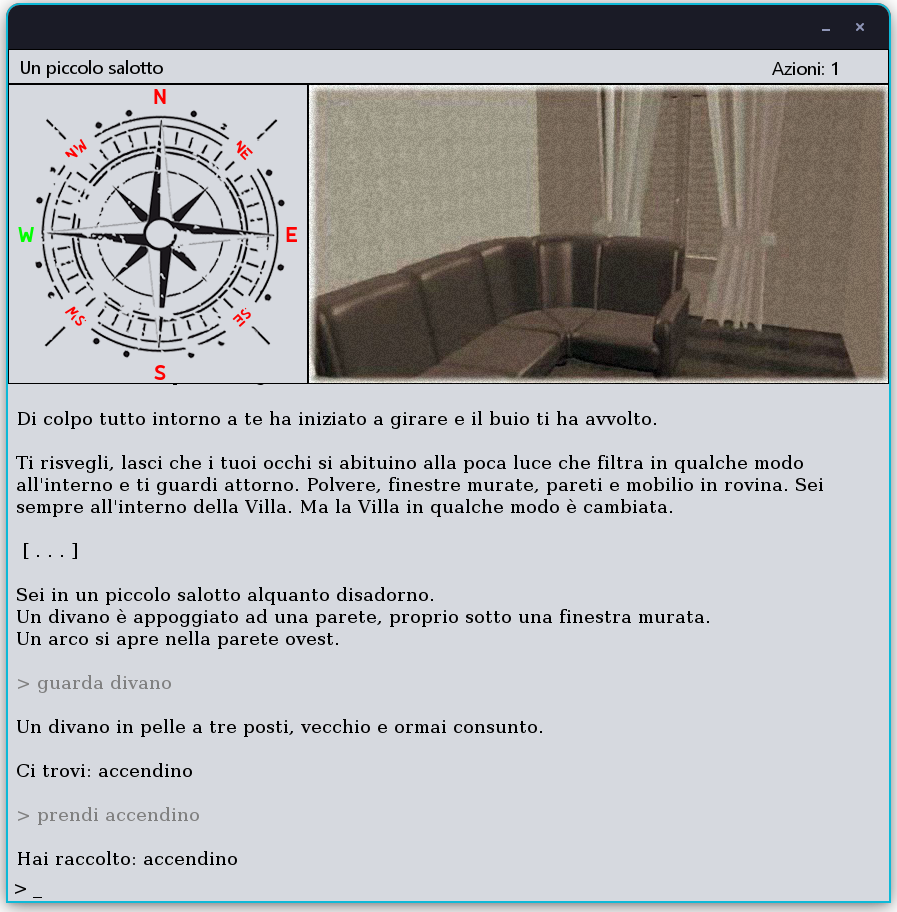

# Progetto esame "Metodi avanzati di programmazione" (UniBA)
## Team: Pierdamiano Zagaria

# 1 Introduzione al progetto
L'idea del progetto é quella di sviluppare un engine/framework con cui é possibile, attraverso l'ausilio di un file json, impostare la propria storia e renderla giocabile. 
Il gioco in sé é un'avventura testuale con alcuni elementi grafici a solo scopo visivo e non interattivi, in quanto gli input vengono dati esclusivamente attraverso un classico box di testo. 
É inclusa nel pacchetto una storia giá impostata e pronta per essere giocata.

## 1.1 The Haunted House
"The Haunted House" é una storia soft-horror che racconta la disavventura di un uomo che si ritrova rinchiuso all'interno di una vecchia villa, circondata dai suoi misteri, alla ricerca dell'amica, proprietaria della casa.

## 1.2 Interfaccia grafica e comandi
Per giocare é sufficiente una tastiera in quanto non é richiesto l'utilizzo del puntatore, se non in caso di presenza di un salvataggio, dal momento che viene richiesta l'interazione con una finestra di dialogo.

L'interfaccia é divisa in piú parti:
- la barra superiore ospita a sinistra il nome della stanza, a destra il contatore delle azioni;
- la bussola, *non* interattiva, indica per ogni direzione attraverso un colore se quella direzione é percorribile o meno:
    - rosso: direzione bloccata da un muro;
    - giallo: direzione bloccata da una porta chiusa;
    - verde: direzione percorribile;
    - blu: direzione da cui si proviene.
- l'immagine della stanza;
- il pannello di output con scrittura sequenziale (per saltare l'animazione basta premere INVIO);
- in basso, il box di testo per l'input.

Il gioco divide le stanze in due tipi principali: 
- *giocabili*;
- *non giocabili* (cutscenes).

Per quanto riguarda le stanze giocabili, sono normali stanze che richiedono azioni del giocatore, mentre le cutscenes sono stanze di passaggio, che tipicamente descrivono la situazione e alla fine richiedono l'input del giocatore (**INVIO**) per continuare, come suggerisce il box di input stesso.

Il gioco quindi richiede dei comandi dal giocatore, dati attraverso frasi immesse nel box di testo. 
Le frasi comprensibili per l'engine sono del tipo *\<azione> \<oggetto> \<oggetto>* dove:
- ***azione***: le azioni in corsivo non richiedono la specifica di oggetti, le azioni in grassetto richiedono la specifica di fino a 2 oggetti, mentre le restanti richiedono solo la specifica di 1 oggetto. 
 **N.B.** Ogni azione ha un suo set di sinonimi, vengono riportati solo i nomi principali.
    - *Nord, Nord-Ovest, Nord-Est, Sud, Sud-Est, Sud-Ovest, Est, Ovest, sali, scendi*
    - *Inventario*
    - *Salva*
    - Esamina
    - Prendi
    - Premi
    - Tira
    - Sposta
    - Indossa
    - Spegni
    - Parla
    - Togli
    - Leggi
    - **Accendi**
    - **Apri**
    - **Inserisci**
    - **Versa**
- ***oggetto***: qualsiasi entitá che sia nella stanza o nell'inventario.

É possibile salvare la partita in qualsiasi momento con il comando "salva", per poi caricare il salvataggio ad un nuovo avvio del gioco. 
**N.B.** Allo stato attuale é presente un solo slot di salvataggio, quindi verrá sempre sovrascritto.

## 1.3 Soluzione del gioco
**N.B.** Per prendere gli oggetti é necessario prima esaminare il contenitore.

Partendo dal salotto, esaminiamo il divano e troveremo un accendino, prendiamolo e proseguiamo verso ovest per il corridoio, poi andiamo a sud.

Ci troveremo nell'ingresso, qui dovremo aprire la porta (apri porta) ed entrare nel vestibolo (a ovest), dove troveremo un cappotto, esaminiamolo e prendiamo la collana al suo interno, dopo di che torniamo indietro al corridoio e questa volta proseguiamo a nord.

Una volta arrivati alla nuova parte di corridoio, apriamo la porta ed entriamo nella cucina (a est), apriamo la credenza e prendiamo la ciotola al suo interno, poi torniamo indietro e andiamo a ovest, arrivando nel salone. Qui andiamo a sud-ovest nell'andito e tiriamo la leva per far cadere il candelabro e renderlo accessibile, quindi torniamo nel salone, guardiamo il candeliere e prendiamo la chiave. A questo punto possiamo tornare nel corridoio e proseguire a nord.

Saliamo le scale e andiamo verso sud, ora dovremmo trovarci nel corridoio del 1° piano. Per prima cosa entriamo nella camera da letto a est, troveremo un candeliere con una candela ma é irraggiungibile, quindi ci basterá spostare il comó (sposta comó), esaminare il candeliere e quindi prendere la candela. Una volta presa la candela, possiamo entrare nel bagno a nord e possiamo esaminare la vasca, rivelando dell'acqua, che possiamo prendere grazie alla ciotola di prima (prendi acqua).

Ora possiamo uscire dal bagno e dalla camera da letto, e proseguire verso sud, dove troveremo un percorso obbligato verso la porta chiusa a chiave ad ovest. Apriamo quindi la porta con la chiave che abbiamo preso nel salone (apri porta con chiave) ed entriamo nello studio, dove troveremo una libreria che andrá spostata, quindi facciamolo (sposta libreria) e verrá rivelata un'incisione della forma di una stella a cinque punte, che é proprio il pendente della nostra collana. Esaminiamo quindi la collana e prendiamo il pendente, poi inseriamolo nell'incisione ("inserisci pendente nell incisione" senza apostrofi) rivelando un passaggio segreto. Entriamoci e scendiamo le scale.

Arriveremo in una stanza completamente buia, infatti non potremo vedere nulla né interagire con nulla, l'unica cosa che potremo fare sará tornare indietro dalla direzione di provenienza, peró noi abbiamo un accendino e una candela, quindi possiamo illuminare la stanza accendendola (accendi candela). Ora che possiamo vedere, proseguiamo verso nord-est e poi sud-est dove troveremo una porta non chiusa a chiave. Apriamola ed entriamo.
 
Finita la cutscene, parliamo almeno una volta con Valeria, prendiamo l'anello e infine torniamo indietro al bivio, per andare a nord.

Adesso dobbiamo indossare l'anello che Valeria ci ha appena dato per poter oltrepassare il varco a nord, quindi indossiamolo (indossa anello) e proseguiamo, trovando l'antro della strega che sta facendo i suoi incantesimi finali. Per sconfiggerla basterá indossare la collana, cosí ci sará possibile interagire con il braciere, e quindi rovesciarci l'acqua della ciotola per spegnerlo (spegni fuoco con acqua), rendendo vani gli sforzi della strega. 

Una volta completate le cutscenes, il gioco sará completato e si chiuderá.

# 2 Struttura del software
## 2.1 Engine
L'engine é la classe che si occupa di gestire tutti i componenti del software e che permette la comunicazione tra essi. 
Contiene riferimenti dei componenti fondamentali (es. GUI) ed esegue il processing dei comandi dati in input.

### 2.1.1 GameManager
Il GameManager é la classe che memorizza lo stato del gioco. Segue il pattern Singleton. 
Contiene la lista delle stanze, dei comandi, degli oggetti nell'inventario e riferimenti alla stanza attuale e precedente.
Contiene metodi per la gestione dello stato (es. `moveTo(room)` che aggiorna la stanza attuale e precedente) e per eventuali aggiunte (es. `addRoom(room)`).

### 2.1.2 GUIManager
Il GUIManager é la classe "middleman" che permette la comunicazione tra manager dei componenti e i chiamanti, per un'interazione piú controllata.
Va registrato il riferimento al MainFrame all'inizializzazione del software.

### 2.1.2.1 CompassManager
Il CompassManager é la classe che gestisce il pannello della bussola della GUI.
Contiene metodi per l'aggiornamento della bussola.
Vanno registrati i riferimenti ai JLabel all'inizializzazione del software.

### 2.1.2.2 OutputManager
L'OutputManager é la classe che gestisce il pannello testuale (output) e il box di testo (input) della GUI.
Contiene metodi per la scrittura e per la gestione dell'input.
Vanno registrati i riferimenti al JTextPane e al JTextField all'inizializzazione del software.

### 2.1.3 SoundManager
Il SoundManager é la classe che si occupa di gestire tutta la parte sonora del software.
Permette la riproduzione di file audio su due canali distinti, uno esclusivo per la musica e uno per gli effetti sonori delle interazioni. 
Allo stato attuale i file musicali, nonostante dovrebbero essere personalizzabili, sono hard-coded e pertanto non personalizzabili. 
Gli effetti sonori delle interazioni invece sono caricati dalle risorse interne al JAR.

### 2.1.4 DBManager
Il DBManager é la classe che permette il salvataggio/caricamento dello stato di gioco.
Contiene metodi utili alla gestione del database H2 e all'esecuzione dei processi di salvataggio o caricamento.

## 2.2 Package Component
Le classi del package `Component` rappresentano i principali elementi costituenti il dominio di gioco. 
Si distinguono in `Room` e `Entity`. Di seguito alcuni esempi piú importanti.

### 2.2.1 GameComponent
Un `GameComponent` é un qualsiasi componente del dominio di gioco che ha un ID, un nome e una descrizione.
É una classe astratta in quanto non é una specializzazione, ma semplicemente una base di partenza.
Tutte le classi del package ereditano da questa classe.

### 2.2.2 AbstractRoom
Una stanza ha un'unica aggiunta al terzetto di variabili iniziale, ovvero il percorso dell'immagine da visualizzare.
Di conseguenza `AbstractRoom` é la base di partenza per le stanze.

### 2.2.3 PlayableRoom
Una `PlayableRoom` contiene variabili di riferimento per le stanze ad ogni direzione (sia gli ID, per il caricamento da json, che le stanze, per l'esecuzione del gioco vera e propria), una lista per gli oggetti contenuti nella stanza, informazioni per lo stato di illuminazione e infine un riferimento ad un `RoomEvent`.
É la stanza piú comunemente utilizzata, **non** prevede alcun tipo di mutabilitá, difatti possiamo definirla "statica".

### 2.2.4 MutableRoom
Una `MutableRoom` é una specializzazione di `PlayableRoom` e come dice il nome, al contrario della classe da cui eredita, possiamo definirla "dinamica".
Attraverso la definizione di una `newRoom` possiamo permettere l'aggiornamento dei campi definiti dall'utente nel JSON, in seguito al trigger di un evento (che puó essere di un qualsiasi oggetto, anche di un'altra stanza).
Le `newRoom` possono anche essere concatenate fino ad avere infinite possibilitá di mutabilitá.
Tutti i campi di una `PlayableRoom` possono essere aggiornati, anche la lista degli oggetti, infatti se aggiungiamo un oggetto nella `newRoom` con un ID non presente nella stanza originale, allora l'oggetto verrá *aggiunto* alla stanza originale (in seugito all'evento), se invece ne aggiungiamo uno con ID identico a un oggetto giá presente, allora verrá *sostituito*.

### 2.2.5 CutsceneRoom 
Una `CutsceneRoom` é una stanza non giocabile che prevede alla fine dell'output di premere INVIO per continuare.
Se viene contrassegnata nel JSON come `finalRoom` allora il gioco terminerá non appena viene premuto INVIO.

### 2.2.6 AbstractEntity
Un'entitá é qualsiasi cosa sia presente nella lista di entitá di una stanza.
Si puó specializzare in molti tipi di entitá diversi che implementano particolari interfacce ad indicare il tipo stesso.
Contiene riferimenti al `parent` (GameComponent) che puó essere sia una stanza che un `AbstractContainer` e al `closestRoomParent` (PlayableRoom) che serve ad identificare la posizione corretta dell'entitá all'interno della stanza (es. Se é in una MutableRoom, al "secondo livello" di newRoom, allora il closestRoomParent sará quella newRoom con ID "0b" dove "0" é la stanza madre e "0a" é il primo figlio).
Contiene una lista di eventi e di `IWearable` per verificare i requisiti di interazione.

Specializzazioni:
- AbstractContainer;
- BasicObject;
- BasicItem;
- FireObject;
- MovableObject (IMovable);
- PullableObject (IPullable);
- PushableObject (IPushable);
- Door (IOpenable);
- UnopenableDoor;
- InvisibleWall;
- Human (ITalkable).

Verranno descritte solo le classi ritenute piú importanti.

### 2.2.7 AbstractContainer
Un container é appunto un contenitore di oggetti. Il funzionamento prevede che (nel gioco) prima di poter accedere agli oggetti al suo interno, é necessario esaminarlo.

Specializzazioni:
- BasicContainer;
- ChestlikeContainer (IOpenable);
- SocketlikeContainer;
- WearableContainer (IWearable).

### 2.2.8 BasicObject
Un `BasicObject` é una qualsiasi entitá la cui unica azione possibile é "Esamina".

### 2.2.9 BasicItem
Un `BasicItem` invece é un qualsiasi oggetto che puó essere preso nell'inventario tramite il comando "Prendi".

Specializzazioni:
- FillableItem (IFillable);
- FluidItem (IFluid);
- LightSourceItem (ILightSource);
- ReadableItem (IReadable);
- WearableItem (IWearable).

### 2.2.10 AbstractEvent
Non eredita da `GameComponent`. 
Un evento é identificato da un tipo che identifica il momento in cui viene attivato ed é composto da un testo, stampato al trigger.

### 2.2.11 RoomEvent
Un `RoomEvent` viene attivato una sola volta e nel momento in cui il giocatore mette piede in una stanza.

### 2.2.12 ObjectEvent
Un `ObjectEvent` ha piú possibilitá di personalizzazione e contiene 2 flag:
- `updatingParentRoom` se al trigger si dovrebbe mutare la stanza madre;
- `destroyOnTrigger` se al trigger si dovrebbe distruggere l'oggetto padre dell'evento.

Inoltre é possibile specificare:
- `updatingTargetRoomId` per mutare una stanza che non é quella madre;
- `teleportsPlayerToRoomId` per teletrasportare il giocatore in un'altra stanza.

# 3 Requisiti richiesti
I **thread** (Sezione 3.1.2) sono stati utilizzati per:
- Inizializzazione e caricamento del gioco (`RoomsLoader`);
- Pannello animazione noise effect sulla GUI (`NoiseFXPanel`);
- Aggiornamento della bussola nella GUI (`CompassManager.updateCompassLabel()` tramite SwingWorker);
- Engine (`Engine.commandPerformed()`);
- Attesa per il tasto INVIO durante le cutscene (`GUIManager.waitUntilEnterIsPressed()`);
- Monitor progresso del caricamento all'avvio del gioco (`GUIManager.createWeatherProgressMonitor()` tramite SwingWorker).

I **Database** (Sezione 3.2) sono stati utilizzati per:
- Salvataggio e caricamento dello stato di gioco (`DBManager`).

Le **API REST** (Sezione 3.3) sono state utilizzate per:
- Controllo in tempo reale del meteo per decidere i suoni ambientali (`WeatherFetcher`).

La **reflection** (Sezione 3.4) é stata utilizzata per:
- Mutabilitá delle stanze (`MutableRoom.updateFields()`);
- Distinguere i tipi di classe durante il caricamento da JSON (`RoomsLoader`);
- Processing dei riferimenti delle stanze (`Rooms.loadDirections()`);
- Metodi utils (`Utils.getField()`).

L'**utilizzo dei file** (es. `MainFrame`) e delle **lambda expressions** (es. `Rooms.loadDirections()`) é invece distribuito in modo omogeneo all'interno dell'intero codice.
Lo stesso vale per l'utilizzo della **Swing**, framework con cui l'intero programma é stato costruito.

Esaminiamo in dettaglio qualche esempio.

## 3.1 Inizializzazione stato di gioco
Prendiamo in esame il caso in cui esista un salvataggio.

All'avvio del gioco verrá chiesto tramite un dialog se si desidera caricare il salvataggio o meno. In entrambi i casi il processo di caricamento verrá affidato a un thread `RoomsLoader` che in base alla nostra scelta caricherá i dati dal JSON o dal DB.
Prima di tutto vengono caricati i comandi nel `GameManager` tramite un thread `CommandsLoader` e nel frattempo verrá caricato tutto lo stato di gioco (stanze con relativi oggetti e inventario).

## 3.1.1 RoomsLoader (Utilizzo dei file)
In base al valore fornito dal dialog che corrisponde alla modalitá desiderata di caricamento (JSON/DB) verranno eseguite procedure diverse.
Se viene scelto il caricamento da JSON, allora viene impostato l'oggetto Gson che permette la lettura del JSON, e viene quindi letto il file `rooms.json`. 
Se l'esecuzione non viene interrotta da alcun errore, gli oggetti presenti in tutte le stanze verranno mappati e ogni singolo oggetto verrá processato al fine di collegare i riferimenti (che da JSON saranno definiti tramite ID).
Se invece viene scelto il caricamento da DB, allora vengono direttamente caricate le stanze e l'inventario grazie al `DBManager` e gli oggetti processati come sopra.

## 3.1.2 RoomsLoader (Programmazione concorrente)
Indipendentemente dalla modalitá scelta, poi, ci sará il processo di collegamento tra le stanze, che é diviso in piú thread (10 per le `PlayableRoom` + 1 per le `CutsceneRoom`), uno per ogni direzione. Ogni thread quindi tramite le referenze dei metodi forniti (**reflection**) ciclerá per tutte le stanze di sua competenza e cercherá l'ID salvato, per poi impostare la referenza alla stanza giusta (es. viene cercato il `northId` nella lista delle stanze e poi viene impostato il `north`). 
Una volta completati tutti i thread, il processo sará completato e il gioco interamente caricato e pronto per essere giocato.

## 3.2 Database - Salvataggi
Il database `SAVEDATA` viene utilizzato per memorizzare in maniera persistente tutte le informazioni al momento del salvataggio, necessarie successivamente a ricostruire l'intero stato del gioco, anche se dovesse essere eliminato il file `rooms.json` (eccetto risorse come immagini o audio).

All'avvio del gioco, se il database non esiste, allora viene creato.
Se, invece, esiste, allora viene visualizzato un dialog per scegliere se caricare o meno il salvataggio, in caso positivo, allora il `DBManager` chiama per ogni componente il metodo `loadFromDB()` e carica il tutto in delle liste che poi verranno processate dal `RoomsLoader` come giá visto. 
In caso di salvataggio durante il gioco, viene prima eliminato il contenuto delle tabelle e poi vengono salvati i componenti tramite il metodo `saveOnDB`.

## 3.2.1 Tabelle
Nel database é presente una tabella per ogni classe componente lo stato di gioco.
Molte stanze e molti oggetti sono effettivamente "statici" e quindi potrebbero essere caricate direttamente dal JSON, tuttavia ció andrebbe contro l'idea del progetto stesso, visto che dovrebbe essere possibile cambiare storia e lista delle stanze a piacimento, di conseguenza il salvataggio verrebbe corrotto e non sarebbe piú possibile continuare la storia giá iniziata. 
L'idea é quindi quella di salvare nelle tabelle ogni variabile definita anche nel JSON cosí da poter essere caricata in modo indipendente.

Le tabelle sono molte e seguono per la maggior parte la struttura delle classi del package Component, di conseguenza vedremo in dettaglio solo alcuni esempi.

Nella tabella `PLAYABLEROOM` vengono salvati:
- ID;
- Nome;
- Descrizione;
- Percorso dell'immagine;
- Se é mutabile;
- L'ID della stanza in cui mutare;
- ID di ogni direzione;
- Se é buia di natura.

Nella tabella `FILLABLEITEM` vengono salvati:
- ID;
- Nome;
- Descrizione;
- ID della stanza in cui si trova (se é in una stanza);
- ID del contenitore in cui si trova (se é in un contenitore);
- Se si trova nell'inventario;
- Se é pieno;
- ID dell'oggetto di cui si riempie.

Nella tabella `OBJECTEVENT` vengono salvati:
- ID dell'oggetto a cui appartiene;
- ID della stanza in cui l'oggetto si trova (per distinguere gli stadi delle stanze mutabili);
- Tipo evento;
- Testo;
- Se dovrebbe mutare la stanza madre al trigger;
- ID della stanza bersaglio da mutare al trigger (se c'é);
- ID della stanza in cui teletrasportare il giocatore al trigger (se c'é);
- Se dovrebbe distruggere l'oggetto padre al trigger.

Esistono poi tabelle ausiliari come `ALIAS` che memorizza per ogni ID (entitá) il suo alias, `ACTIONSCOUNTER` che memorizza il valore attuale del numero di azioni, `CURRENTROOM` che memorizza l'ID della stanza attuale e di quella precedente, `HUMANPHRASES` che memorizza per ogni ID (entitá) una frase (in ordine) e `REQUIREDWEAREDITEM` che memorizza per ogni ID (entitá) di che oggetto indossato ha bisogno per interagirci.

## 3.3 API REST - AccuWeather
Il gioco prevede un controllo in tempo reale in base alla posizione reale (tramite IP) del meteo, per decidere se riprodurre il sottofondo da pioggia o normale.
In caso di connessione assente, verrá usato il valore di default, ovvero sottofondo normale. 
Il check viene effettuato ogni 30 minuti a partire dall'avvio del gioco e prevede i seguenti passaggi:
1. Ricava l'IP tramite un sito internet che fornisce il servizio. (eseguito solo all'avvio del gioco)
2. Tramite l'API per le `locationKey` via IP verrá fatta una GET request passandogli l'IP appena ricavato. In caso di successo, salverá la chiave ricavata, altrimenti userá la chiave di default (BARI). (eseguito solo all'avvio del gioco)
3. Tramite l'API per le condizioni atmosferiche verrá fatta una GET request passandogli la locationKey ricavata e verrá salvato in memoria il JSON di risposta.
4. Viene fatto il parsing del JSON e viene ricercato il campo di interesse `HasPrecipitation` che verrá restituito al chiamante della funzione.

## 3.4 Reflection - mutabilitá delle stanze
Come giá visto, le `MutableRoom` prevedono una `newRoom` da cui andare a prendere eventuali campi da aggiornare, ció é reso possibile grazie alla reflection.
Ogni volta che viene richiesto ad una stanza di mutare, la procedura é la seguente:
- Per ogni campo non `null` e non `id` della classe definita da newRoom (Playable o Mutable)
- se il campo non é una lista, allora possiamo aggiornare il campo della stanza madre con quello nuovo, altrimenti
- se il campo é una lista, allora é la lista degli oggetti nuovi e bisogna verificare se va semplicemente aggiunto (se l'ID dell'oggetto non é giá presente) o sovrascritto a un oggetto giá presente nella stanza madre. In ogni caso, viene aggiornato il campo dell'oggetto `closestRoomParent` per far corrispondere la nuova stanza (es. da "15a" diventa "15").
- finito il ciclo dei campi, si controlla se c'é un altro grado di `newRoom`, altrimenti si setta a `null`. 

## 3.5 Swing - MainFrame
Il `MainFrame` é una classe che estende il `JFrame` e rappresenta l'intera GUI di gioco.
La sua dimensione é fissa (881 x 852) per evitare problemi di proporzionamento con le immagini user-defined (vengono ridimensionate a 581 x 300).

Contiene diversi componenti organizzati su un `BorderLayout`:
- `pnlHeader`, la top-bar che contiene
    - `lblRoomName`, il label contenente il nome della stanza;
    - `lblActions`, il label contenente il contatore delle azioni.
- `pnlInOut`, il pannello che contiene
    - `txtPane`, pannello di testo (output)
    - `txtInput`, box di testo (input)
- `pnlCompass`, pannello che contiene
    - `pnlCompassNorth`, pannello che contiene
        - `lblCompassNorthImage`, label contenente l'immagine;
        - `lblCompassNorthText`, label ruotato contenente "N".
    - `pnlCompassSouth`, pannello che contiene
        - `lblCompassSouthImage`, label contenente l'immagine;
        - `lblCompassSouthText`, label ruotato contenente "S".
    - ...
- `lypRoomImage`, pannello a livelli che contiene, in ordine
    - `noisePanel`, pannello per l'animazione simil-vecchia TV (top)
    - `lblRoomImage`, label per l'immagine della stanza (bottom)