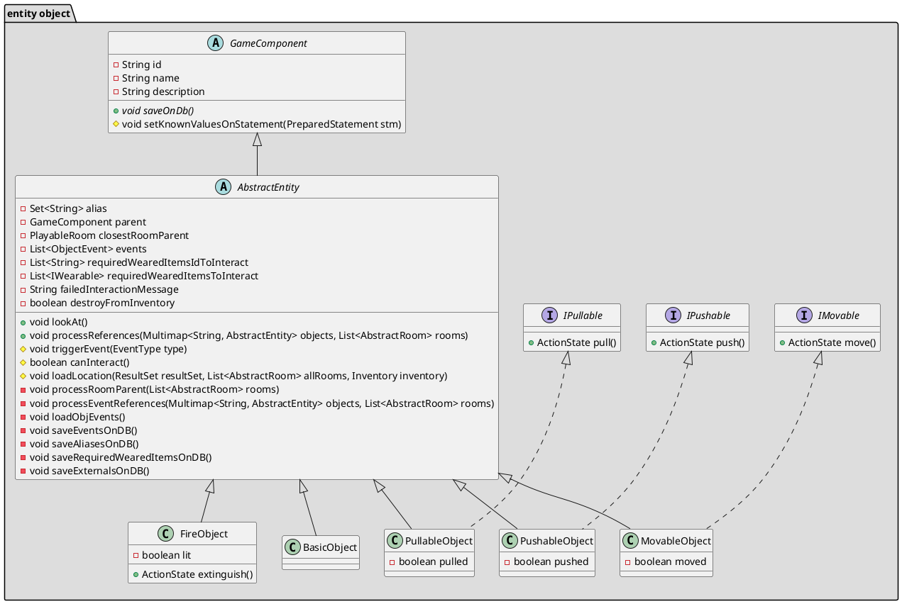

```plantuml
@startuml
package "entity object" #DDDDDD {
    abstract class GameComponent {
        - String id
        - String name
        - String description
        + {abstract} void saveOnDb()
        # void setKnownValuesOnStatement(PreparedStatement stm)
    }
    
    abstract class AbstractEntity extends GameComponent {
        - Set<String> alias
        - GameComponent parent
        - PlayableRoom closestRoomParent
        - List<ObjectEvent> events
        - List<String> requiredWearedItemsIdToInteract
        - List<IWearable> requiredWearedItemsToInteract
        - String failedInteractionMessage
        - boolean destroyFromInventory
        + void lookAt()
        + void processReferences(Multimap<String, AbstractEntity> objects, List<AbstractRoom> rooms)
        # void triggerEvent(EventType type)
        # boolean canInteract()
        # void loadLocation(ResultSet resultSet, List<AbstractRoom> allRooms, Inventory inventory)
        - void processRoomParent(List<AbstractRoom> rooms)
        - void processEventReferences(Multimap<String, AbstractEntity> objects, List<AbstractRoom> rooms)
        - void loadObjEvents()
        - void saveEventsOnDB()
        - void saveAliasesOnDB()
        - void saveRequiredWearedItemsOnDB()
        - void saveExternalsOnDB()
    }
    
    
    
    together {
        interface IMovable {
            + ActionState move()
        }
    
        interface IPushable {
            + ActionState push()
        }
    
        interface IPullable {
            + ActionState pull()
        }
    }
    
    together {
        class BasicObject extends AbstractEntity {
        }
        
        class FireObject extends AbstractEntity {
            - boolean lit
            + ActionState extinguish()
        }
        
        class MovableObject extends AbstractEntity implements IMovable {
            - boolean moved
        }
        
        class PullableObject extends AbstractEntity implements IPullable {
            - boolean pulled
        }
        
        class PushableObject extends AbstractEntity implements IPushable{
            - boolean pushed
        }
    }
}
@enduml

@startuml
package "entity pickupable" #DDDDDD {
    abstract class GameComponent {
        - String id
        - String name
        - String description
        + {abstract} void saveOnDb()
        # void setKnownValuesOnStatement(PreparedStatement stm)
    }
    
    abstract class AbstractEntity extends GameComponent {
        - Set<String> alias
        - GameComponent parent
        - PlayableRoom closestRoomParent
        - List<ObjectEvent> events
        - List<String> requiredWearedItemsIdToInteract
        - List<IWearable> requiredWearedItemsToInteract
        - String failedInteractionMessage
        - boolean destroyFromInventory
        + void lookAt()
        + void processReferences(Multimap<String, AbstractEntity> objects, List<AbstractRoom> rooms)
        # void triggerEvent(EventType type)
        # boolean canInteract()
        # void loadLocation(ResultSet resultSet, List<AbstractRoom> allRooms, Inventory inventory)
        - void processRoomParent(List<AbstractRoom> rooms)
        - void processEventReferences(Multimap<String, AbstractEntity> objects, List<AbstractRoom> rooms)
        - void loadObjEvents()
        - void saveEventsOnDB()
        - void saveAliasesOnDB()
        - void saveRequiredWearedItemsOnDB()
        - void saveExternalsOnDB()
    }
    
    
    
    interface IPickupable {
        + ActionState pickup()
    }
    
    interface IFillable {
        + ActionState fill()
    }
    
    interface IFluid {
        + void delete()
    }
    
    interface ISwitch {
        + ActionState turnOn()
        + ActionState turnOff()
    }
    
    interface ILightSource extends ISwitch {
    }
    
    interface IReadable {
        + ActionState read()
    }
    
    interface IWearable extends IPickupable {
        + ActionState wear()
        + ActionState unwear()
    }
    
    class BasicItem extends AbstractEntity implements IPickupable {
        - boolean pickedUp
    }
    
    together {
        class FillableItem extends BasicItem implements IFillable {
            - boolean filled
            - String eligibleItemId
            - AbstractEntity eligibleItem
        }
        
        class FluidItem extends BasicItem implements IFluid {
        }
        
        class LightSourceItem extends BasicItem implements ILightSource {
            - boolean on
            - String requiredItemId
            - BasicItem requiredItem
        }
        
        class ReadableItem extends BasicItem implements IReadable {
            - String readText
        }
        
        class WearableItem extends BasicItem implements IWearable{
            - boolean worn
        }
    }
}
@enduml

@startuml
package "entity humanoid" #DDDDDD {
    abstract class GameComponent {
        - String id
        - String name
        - String description
        + {abstract} void saveOnDb()
        # void setKnownValuesOnStatement(PreparedStatement stm)
    }
    
    abstract class AbstractEntity extends GameComponent {
        - Set<String> alias
        - GameComponent parent
        - PlayableRoom closestRoomParent
        - List<ObjectEvent> events
        - List<String> requiredWearedItemsIdToInteract
        - List<IWearable> requiredWearedItemsToInteract
        - String failedInteractionMessage
        - boolean destroyFromInventory
        + void lookAt()
        + void processReferences(Multimap<String, AbstractEntity> objects, List<AbstractRoom> rooms)
        # void triggerEvent(EventType type)
        # boolean canInteract()
        # void loadLocation(ResultSet resultSet, List<AbstractRoom> allRooms, Inventory inventory)
        - void processRoomParent(List<AbstractRoom> rooms)
        - void processEventReferences(Multimap<String, AbstractEntity> objects, List<AbstractRoom> rooms)
        - void loadObjEvents()
        - void saveEventsOnDB()
        - void saveAliasesOnDB()
        - void saveRequiredWearedItemsOnDB()
        - void saveExternalsOnDB()
    }
    
    
    together {
        interface ITalkable {
            + ActionState talk()
        }
        
        class Human extends AbstractEntity implements ITalkable {
            - Queue<String> phrases
            + void queuePhrase(String phrase)
        }
    }
}
@enduml

@startuml
package "entity doorlike" #DDDDDD {
    abstract class GameComponent {
        - String id
        - String name
        - String description
        + {abstract} void saveOnDb()
        # void setKnownValuesOnStatement(PreparedStatement stm)
    }
    
    abstract class AbstractEntity extends GameComponent {
        - Set<String> alias
        - GameComponent parent
        - PlayableRoom closestRoomParent
        - List<ObjectEvent> events
        - List<String> requiredWearedItemsIdToInteract
        - List<IWearable> requiredWearedItemsToInteract
        - String failedInteractionMessage
        - boolean destroyFromInventory
        + void lookAt()
        + void processReferences(Multimap<String, AbstractEntity> objects, List<AbstractRoom> rooms)
        # void triggerEvent(EventType type)
        # boolean canInteract()
        # void loadLocation(ResultSet resultSet, List<AbstractRoom> allRooms, Inventory inventory)
        - void processRoomParent(List<AbstractRoom> rooms)
        - void processEventReferences(Multimap<String, AbstractEntity> objects, List<AbstractRoom> rooms)
        - void loadObjEvents()
        - void saveEventsOnDB()
        - void saveAliasesOnDB()
        - void saveRequiredWearedItemsOnDB()
        - void saveExternalsOnDB()
    }
    
    
    
    interface IOpenable {
        + ActionState open()
    }
    
    together {
        class Door extends AbstractEntity implements IOpenable {
            - boolean open
            - boolean locked
            - String unlockedWithItemId
            - AbstractEntity unlockedWithItem
            - String blockedRoomId
            - AbstractRoom blockedRoom
        }
        
        class InvisibleWall extends AbstractEntity {
            - boolean locked
            - String trespassingWhenLockedText
            - String blockedRoomId
            - boolean northBlocked
            - boolean southBlocked
            - boolean eastBlocked
            - boolean westBlocked
            - boolean northEastBlocked
            - boolean northWestBlocked
            - boolean southEastBlocked
            - boolean southWestBlocked
            - boolean upBlocked
            - boolean downBlocked
            + void processRequirements()
            + boolean isBlocking(Type direction)
        }
        
        class UnopenableDoor extends AbstractEntity {
            - String openEventText
        }
    }
}
@enduml

@startuml
package "entity container" #DDDDDD {
    abstract class GameComponent {
        - String id
        - String name
        - String description
        + {abstract} void saveOnDb()
        # void setKnownValuesOnStatement(PreparedStatement stm)
    }
    
    abstract class AbstractEntity extends GameComponent {
        - Set<String> alias
        - GameComponent parent
        - PlayableRoom closestRoomParent
        - List<ObjectEvent> events
        - List<String> requiredWearedItemsIdToInteract
        - List<IWearable> requiredWearedItemsToInteract
        - String failedInteractionMessage
        - boolean destroyFromInventory
        + void lookAt()
        + void processReferences(Multimap<String, AbstractEntity> objects, List<AbstractRoom> rooms)
        # void triggerEvent(EventType type)
        # boolean canInteract()
        # void loadLocation(ResultSet resultSet, List<AbstractRoom> allRooms, Inventory inventory)
        - void processRoomParent(List<AbstractRoom> rooms)
        - void processEventReferences(Multimap<String, AbstractEntity> objects, List<AbstractRoom> rooms)
        - void loadObjEvents()
        - void saveEventsOnDB()
        - void saveAliasesOnDB()
        - void saveRequiredWearedItemsOnDB()
        - void saveExternalsOnDB()
    }
    
    
    together {
        interface IPickupable {
            + ActionState pickup()
        }
        
        interface IWearable extends IPickupable {
            + ActionState wear()
            + ActionState unwear()
        }
        
        interface IOpenable {
            + ActionState open()
        }
    }
    
    abstract class AbstractContainer extends AbstractEntity {
        # boolean contentRevealed
        - List<AbstractEntity> list
        - boolean forFluids
        + void add(AbstractEntity object)
        + void removeObject(AbstractEntity object)
        + StringBuilder getContentString()
        + ActionState insert(AbstractEntity obj, Inventory inventory)
        + {static} List<AbstractEntity> getAllObjectsInside(AbstractEntity obj)
        + {static} void addObjectToContainerId(AbstractEntity object, List<AbstractEntity> list, String id)
    }
    
    together {
        class BasicContainer extends AbstractContainer {
        }
        
        class ChestlikeContainer extends AbstractContainer implements IOpenable {
            - boolean open
            - boolean locked
            - String unlockedWithItemId
            - AbstractEntity unlockedWithItem
        }
        
        class SocketlikeContainer extends AbstractContainer {
            - boolean itemInside
            - String eligibleItemId
            - BasicItem eligibleItem
        }
        
        class WearableContainer extends AbstractContainer implements IWearable{
            - boolean worn
            - boolean pickedUp
            - int maxSlots
        }
    }
}
@enduml

@startuml
package "event" #DDDDDD {
    enum EventType {
        LOOK_AT
        OPEN_CONTAINER
        PICK_UP
        PULL
        AT_ROOM_ENTRANCE
        OPEN_UNLOCKED
        OPEN_LOCKED
        PUSH
        MOVE
        INSERT
        WEAR
        EXTINGUISH
        TALK_WITH
        UNWEAR
        READ
        TURN_ON
        TURN_OFF
    }
    
    abstract class AbstractEvent {
        - String text
    }
    
    AbstractEvent --> EventType : - eventType
    
    together {
        class ObjectEvent extends AbstractEvent {
            - String updateTargetRoomId
            - MutableRoom updateTargetRoom
            - boolean updatingParentRoom
            - String teleportsPlayerToRoomId
            - AbstractRoom teleportsPlayerToRoom
            - boolean destroyOnTrigger
            + void trigger(AbstractEntity obj)
            + {static} ObjectEvent getEvent(List<ObjectEvent> events, EventType type)
        }
        
        class RoomEvent extends AbstractEvent {
        }
    }
}
@enduml

@startuml
package "room" #DDDDDD {
    abstract class GameComponent {
        - String id
        - String name
        - String description
        + {abstract} void saveOnDb()
        # void setKnownValuesOnStatement(PreparedStatement stm)
    }
    
    abstract class AbstractRoom extends GameComponent {
        - String imgPath
        # void setSecondaryId(char value)
    }
    
    together {
        class PlayableRoom extends AbstractRoom {
            - AbstractRoom south
            - String southId
            - AbstractRoom north
            - String northId
            - AbstractRoom southWest
            - String southWestId
            - AbstractRoom northWest
            - String northWestId
            - AbstractRoom southEast
            - String southEastId
            - AbstractRoom northEast
            - String northEastId
            - AbstractRoom east
            - String eastId
            - AbstractRoom west
            - String westId
            - AbstractRoom up
            - String upId
            - AbstractRoom down
            - String downId
            - List<AbstractEntity> objects
            - RoomEvent event
            - boolean dark
            - boolean darkByDefault
            + List<AbstractEntity> getObjects()
            + List<AbstractEntity> getObjects(Mode mode)
            + Multimap<String, AbstractEntity> getObjectsAsMap(Mode mode)
            + void removeObject(AbstractEntity obj)
            + InvisibleWall getInvisibleWall(Type direction)
            + AbstractRoom getRoomAt(Type direction)
            + void triggerEvent()
            + void processRoomLighting(List<AbstractEntity> inventory)
        }
        
        class CutsceneRoom extends AbstractRoom {
            - String nextRoomId
            - AbstractRoom nextRoom
            - boolean finalRoom
        }
        
        class MutableRoom extends PlayableRoom {
            - MutableRoom newRoom
            - void updateFields()
            + List<AbstractRoom> getAllRooms()
            + void updateToNewRoom()
        }
    }
}
@enduml

@startuml
package component {
    package entity #DDDDDD {
        package container {
            package pickupable #BDBDBD
        }
        package doorlike
        package humanoid
        package interfaces
        package object
        package pickupable
    }
    package event #DDDDDD
    package room #DDDDDD
}
@enduml
```